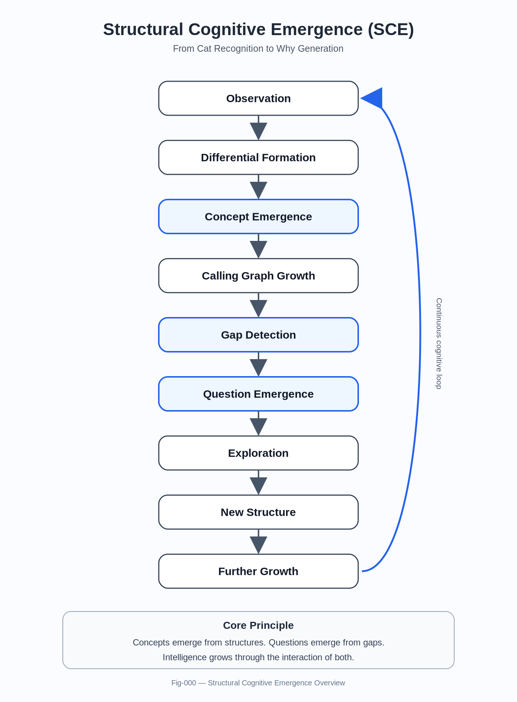
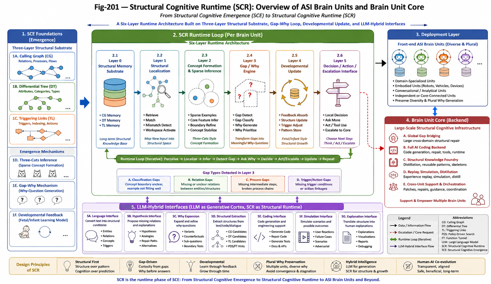

# README.md — Minimal Update Draft for the SCE Runtime Expansion Release

# Structural Cognitive Emergence (SCE)

**Structural Cognitive Emergence (SCE)** studies how structural cognition may emerge from sparse examples, structural gaps, and developmental feedback rather than from brute-force memorization or purely black-box pattern fitting. The project explores concept formation, gap-driven why-generation, structural learning, and the minimum algorithmic substrate required for future **brain-unit intelligence**.

The repository gradually develops a structural view of cognition built around:

* **Calling Graphs (CG)** for relations, processes, and flow structure,
* **Differential Trees (DT)** for categories, properties, naming, and concept boundaries,
* **Triggering Links (TL)** for event/action indexing, threshold triggering, and action readiness,
* **Three-Cats-style sparse concept formation**,
* **Gap / Why mechanisms** for active structural questioning,
* and **developmental structural update** inspired by fetal/infant learning feedback.

Over time, these ideas lead from **structural cognitive emergence** toward a first **runtime architecture** for structural cognition and **ASI Brain Units**.

---

### Fig-000-SCE-Overview.png

---

# Runtime Expansion Release

This release marks an important transition in the SCE line:

> **from Structural Cognitive Emergence to Structural Cognitive Runtime (SCR).**

The main additions in this release are:

* **SCE-014 — THREE-CATS REASONING, GAP WHY, AND STRUCTURAL COGNITIVE RUNTIME**
* **SCE-015 — STRUCTURAL COGNITIVE RUNTIME: THE TWIN OF KNOWLEDGE AND MECHANISM**
* **SCE-016 — Structural Cognitive Runtime (SCR): PRD for ASI Brain Units and Brain Unit Core**
* **Fig-201 — Structural Cognitive Runtime (SCR): Overview of ASI Brain Units and Brain Unit Core**

Together, these additions extend SCE from an emergence-level account of structural cognition toward a first **runtime architecture** for:

* local structural cognitive units (**ASI Brain Units**),
* a larger back-end **Brain Unit Core**,
* and future **LLM-hybrid structural cognitive systems**.

This release does **not** replace the earlier SCE line. Instead, it builds on it. The repository should still be read as a continuous progression from sparse concept formation and gap-driven why generation toward structural cognitive runtime.

---

---

# What This Repository Studies

At a high level, SCE asks a family of connected questions:

1. **How can a concept emerge from only a few structurally informative examples?**
2. **How do structural gaps give rise to “why” questions?**
3. **How can knowledge grow in situ through interaction, mismatch, and feedback?**
4. **What structural substrate is required for these processes?**
5. **How do these emergence mechanisms scale toward runtime architectures for autonomous cognitive units?**

The repository approaches these questions through a sequence of texts that move from:

* the **cat problem** and sparse concept formation,
* to **gap detection and question emergence**,
* to **structural cognitive emergence as a general framework**,
* and finally to **Structural Cognitive Runtime (SCR)**.

---

# Reading Guide by Theme

The original document order is preserved.
For new readers, the repository can be read in **four thematic phases**.

---

## Part I — Foundations of Structural Cognitive Emergence

These texts introduce the basic problem of sparse structural concept formation and the need for structural, rather than purely statistical, accounts of cognition.

* **SCE-001 — THE-CAT-PROBLEM.md**
* **SCE-002 — DIFFERENTIAL-CONCEPT-FORMATION.md**
* **SCE-003 — IN-SITU-KNOWLEDGE-GROWTH.md**
* **SCE-004 — CALLING-GRAPH-EMERGENCE.md**
* **SCE-005 — GAP DETECTION AND WHY GENERATION.md**
* **SCE-006 — QUESTION EMERGENCE.md**

**Recommended for readers who want the basic emergence story first.**

---

## Part II — Human Development, Education, and Why Preservation

These texts extend the discussion from isolated concept formation toward developmental cognition, question preservation, and the broader human meaning of structural why-generation.

* **SCE-007 — CHILDREN, SCIENTISTS, AND ENTREPRENEURS.md**
* **SCE-008 — EDUCATION AS QUESTION PRESERVATION.md**
* **SCE-009 — FROM WHY TO AUTONOMOUS AI.md**

**Recommended for readers interested in learning, education, human development, and why-preserving intelligence.**

---

## Part III — SCE as a General Structural Framework

These texts present SCE more explicitly as a general structural framework and connect it to cross-graph reasoning, LLMs, and methodology.

* **SCE-010 — STRUCTURAL COGNITIVE EMERGENCE.md**
* **SCE-011 — CROSS-GRAPH GAP EMERGENCE.md**
* **SCE-012 — LLMs and Structural Cognitive Emergence.md**
* **SCE-013 — FROM PRACTITIONER INTERVIEWS TO STRUCTURAL DISCOVERY.md**

**Recommended for readers who want the broader framework view before entering the runtime phase.**

---

## Part IV — Runtime Phase: From Emergence to Structural Cognitive Runtime (SCR)

These texts mark the transition from emergence-level theory to runtime-level architecture.

* **SCE-014 — THREE-CATS REASONING, GAP WHY, AND STRUCTURAL COGNITIVE RUNTIME.md**
* **SCE-015 — STRUCTURAL COGNITIVE RUNTIME: THE TWIN OF KNOWLEDGE AND MECHANISM.md**
* **SCE-016 — Structural Cognitive Runtime (SCR): PRD for ASI Brain Units and Brain Unit Core.md**

This phase develops the idea that structural cognition should not remain only a theory of emergence. It should also be organized into an explicit runtime architecture with:

* structural memory,
* structural localization,
* sparse concept formation,
* gap / why generation,
* developmental update,
* and decision / action / escalation interfaces.

**Recommended for readers specifically interested in ASI Brain Units, Brain Unit Core, runtime design, and the transition from SCE to SCR.**

---

# Suggested Reading Paths

## If you are new to the repository

Read in this order:

1. **SCE-001 — THE-CAT-PROBLEM**
2. **SCE-005 — GAP DETECTION AND WHY GENERATION**
3. **SCE-010 — STRUCTURAL COGNITIVE EMERGENCE**
4. **SCE-014 — THREE-CATS REASONING, GAP WHY, AND STRUCTURAL COGNITIVE RUNTIME**
5. **SCE-016 — Structural Cognitive Runtime (SCR)**

This path gives the shortest route from the original cat problem to the new runtime phase.

## If you want the runtime line directly

Start with:

1. **SCE-014**
2. **SCE-015**
3. **SCE-016**

Then go back to:

* **SCE-001 / 002 / 005 / 010** as needed for foundations.

## If you are mainly interested in LLM / AI system implications

Start with:

1. **SCE-009 — FROM WHY TO AUTONOMOUS AI**
2. **SCE-012 — LLMs and Structural Cognitive Emergence**
3. **SCE-014**
4. **SCE-015**
5. **SCE-016**

---

# Figures / Quick Links

## Key Runtime Figure

* **Fig-201 — Structural Cognitive Runtime (SCR): Overview of ASI Brain Units and Brain Unit Core**

This figure summarizes the runtime expansion of SCE and shows the relationship among:

* the SCE foundations,
* the six-layer SCR runtime loop,
* front-end ASI Brain Units,
* back-end Brain Unit Core,
* and LLM-hybrid runtime interfaces.

## Key Framework Texts

* **SCE-010 — STRUCTURAL COGNITIVE EMERGENCE**
* **SCE-014 — THREE-CATS REASONING, GAP WHY, AND STRUCTURAL COGNITIVE RUNTIME**
* **SCE-015 — STRUCTURAL COGNITIVE RUNTIME: THE TWIN OF KNOWLEDGE AND MECHANISM**
* **SCE-016 — Structural Cognitive Runtime (SCR): PRD for ASI Brain Units and Brain Unit Core**

## If you want the shortest bridge from SCE to runtime

Read:

* **SCE-005**
* **SCE-010**
* **SCE-014**
* **SCE-015**
* **SCE-016**

---

# Repository Status

The repository currently spans two closely connected phases:

## Phase A — Structural Cognitive Emergence

How structural concepts, gaps, and why-mechanisms emerge from sparse examples, mismatch, and developmental feedback.

## Phase B — Structural Cognitive Runtime

How those mechanisms may be organized into an explicit runtime architecture for:

* **ASI Brain Units**,
* **Brain Unit Core**,
* and future **LLM-hybrid structural cognitive systems**.

The current release should be understood as the beginning of **SCE’s runtime phase**, not as a replacement of the earlier emergence work.

---

# Related Direction of This Release

This runtime expansion is especially relevant to readers interested in:

* sparse concept formation,
* gap-driven why generation,
* developmental structural learning,
* structural cognitive runtime,
* ASI Brain Units,
* Brain Unit Core,
* and future structural alternatives or complements to purely monolithic LLM-based AI systems.

---

## Author

Sizhe Tan\
Independent Researcher

GPT-Obot\
AI Research Assistant

2026

## Citation

DOI: 10.5281/zenodo.20778456

## License

Apache-2.0

---

## 📚 DBM-SI Series Navigation

See:\
[./docs/DBM-SI-Series-of-gitHub-Repositories/DBM-SI-Series-of-gitHub-Repositories.md](./docs/DBM-SI-Series-of-gitHub-Repositories/DBM-SI-Series-of-gitHub-Repositories.md)

[./docs/DBM-SI-Series-of-gitHub-Repositories/DBM-SI-Structural-Intelligence-Dictionary-(v2).md](./docs/DBM-SI-Series-of-gitHub-Repositories/DBM-SI-Structural-Intelligence-Dictionary-(v2).md)
