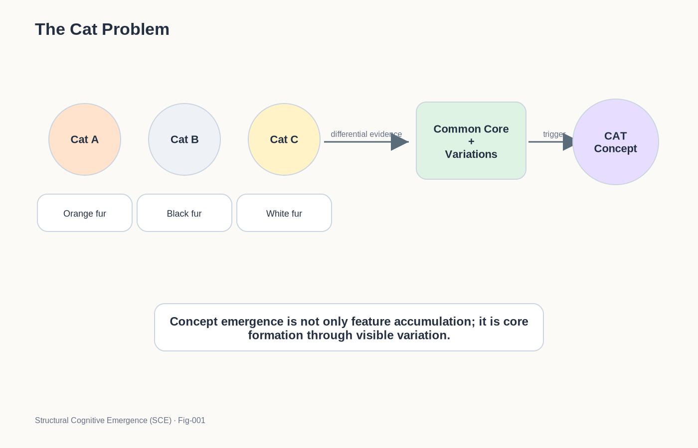
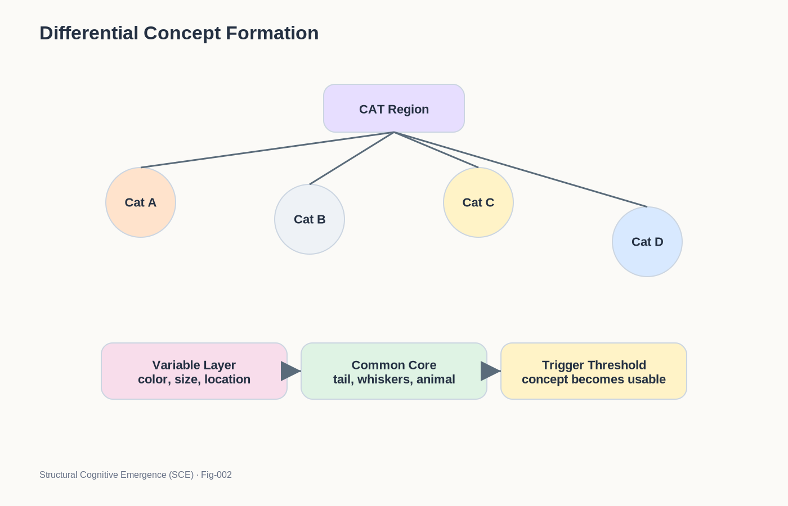
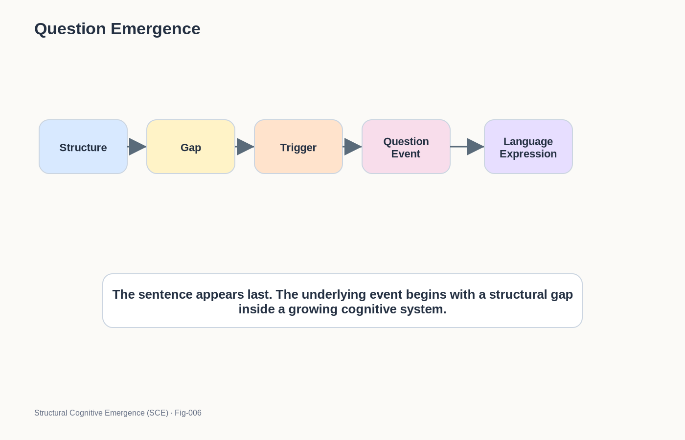
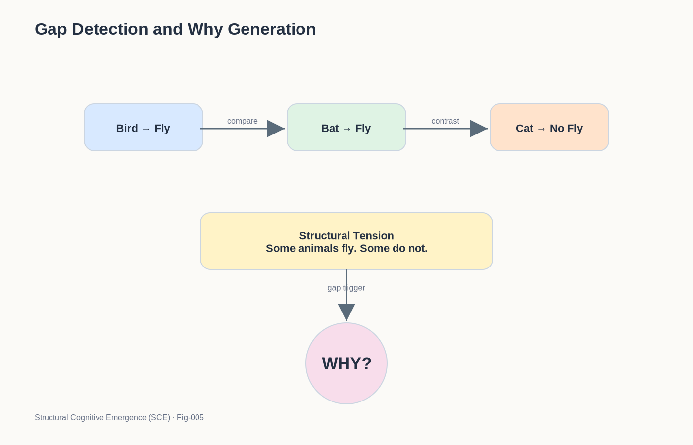
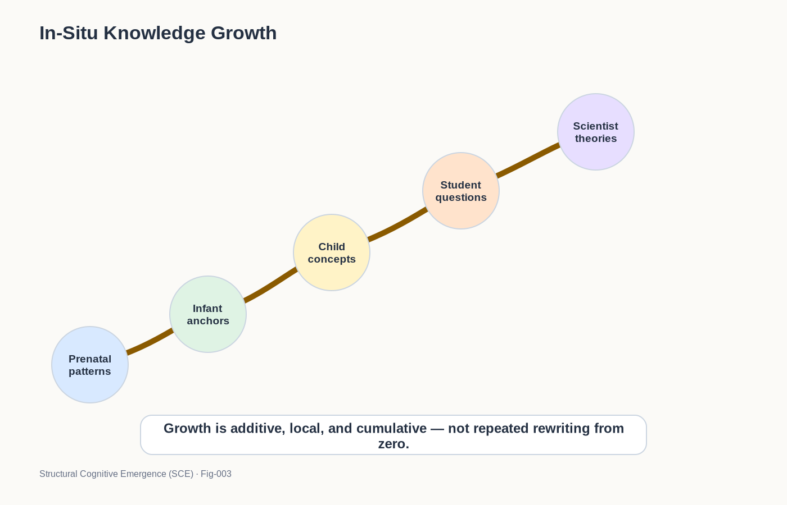
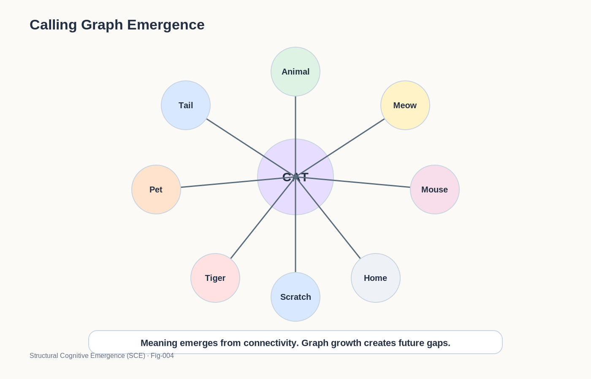
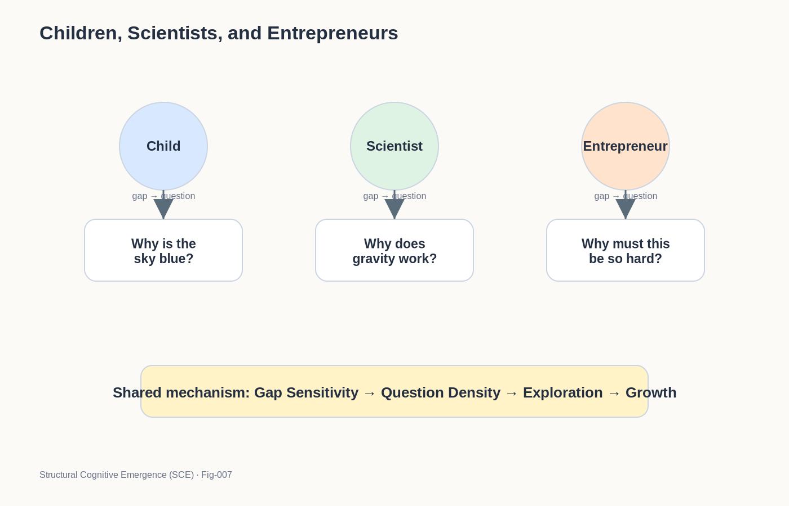
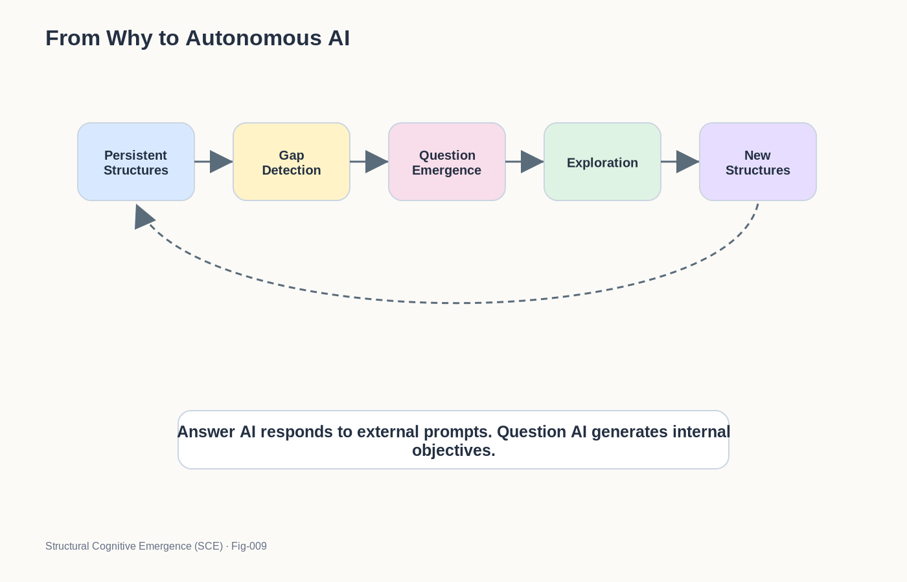

# Structural Cognitive Emergence (SCE)
## From Cat Recognition to Why Generation
### A Structural Theory of Concept Formation, Question Emergence, and Cognitive Growth

## The Core Idea

Structural Cognitive Emergence (SCE) explores a simple but profound hypothesis:

> Concepts emerge from structures.
>
> Questions emerge from gaps.
>
> Intelligence grows through the continuous interaction of both.

In the SCE framework:

```text
Structure
↓
Gap
↓
Question
↓
Exploration
↓
New Structure
```

forms a self-sustaining cognitive growth loop.

This repository investigates how this loop may explain:

* concept formation,
* childhood curiosity,
* scientific discovery,
* entrepreneurship,
* education,
* autonomous AI,
* and future multi-brain cognitive systems.

---

### Fig-000-SCE-Overview.png


---

## Introduction

One of the deepest mysteries in intelligence is surprisingly simple.

A child sees three cats.

A few days later, the child suddenly understands:

> "This is a cat."

Soon after that, the child begins asking:

> Why do cats meow?

> Why do dogs not meow?

> Why do tigers look like cats?

> Why are some animals pets while others are not?

At first glance, these seem like ordinary childhood questions.

But hidden inside them may be one of the most important unsolved problems in cognitive science, education, and artificial intelligence.

How does a concept emerge from only a few examples?

How does a question emerge from a newly formed concept?

And why can a young child do this naturally while modern AI systems often require enormous amounts of data?

This repository explores these questions from a structural perspective.

## Inspiration

A major inspiration for this project comes from observations made by Transformer co-author Lukasz Kaiser.

In recent interviews, Kaiser repeatedly highlighted two fundamental puzzles:

### Puzzle 1: The Cat Problem

A child may see only a handful of cats and quickly acquire the concept of "cat."

Modern AI systems often require orders of magnitude more examples to achieve comparable robustness.

Why?

---
### Fig-001-THE-CAT-PROBLEM.png



---

### Puzzle 2: The Autonomous AI Problem

Current AI systems are becoming increasingly capable of answering questions.

However, they rarely generate meaningful new questions on their own.

Why?

These two puzzles appear unrelated.

This repository proposes that they may actually originate from the same underlying mechanism.

## The Central Hypothesis

The central hypothesis of Structural Cognitive Emergence (SCE) is:

> Concepts and questions are not stored objects.

> They are emergent events arising from the growth of cognitive structures.

In this view:

- Concepts emerge when differential structures accumulate sufficient evidence.
- Questions emerge when growing structures encounter unresolved gaps.
- Learning emerges through iterative cycles of structure growth and gap resolution.

Intelligence is therefore not merely answer generation.

Intelligence is the continuous emergence of concepts, questions, and new structures.

---
### Fig-002-DIFFERENTIAL-CONCEPT-FORMATION.png



---

## From Recognition to Why

Traditional AI systems are often viewed as:

    Input
     ↓
    Prediction
     ↓
    Output

SCE proposes a different perspective:

    Observation
     ↓
    Differential Growth
     ↓
    Concept Emergence
     ↓
    Graph Expansion
     ↓
    Gap Detection
     ↓
    Question Emergence
     ↓
    Exploration
     ↓
    Cognitive Growth

The most important step may not be the answer.

The most important step may be the appearance of the question.

## Why Children Ask So Many Questions

---
### Fig-006-QUESTION-EMERGENCE.png



---

Children are often viewed as asking questions because they know very little.

SCE proposes a different interpretation.

Children may ask many questions because their cognitive structures are growing rapidly.

As concepts accumulate:

- new relationships appear,
- new comparisons become possible,
- new contradictions emerge,
- new gaps become visible.

Questions naturally arise from these gaps.

In this view:

> A question is not evidence of ignorance.

> A question may be evidence of cognitive growth.

## Gap Detection and Why Generation

---
### Fig-005-GAP-DETECTION-AND-WHY-GENERATION.png



---

One of the core ideas explored in this repository is:

> Why may be the linguistic expression of a structural gap.

When a cognitive system encounters:

- an inconsistency,
- a missing relationship,
- an unexplained transition,
- an incomplete calling graph,

a gap becomes visible.

The appearance of a gap may trigger:

    WHY?

Questions therefore do not need to be pre-stored.

Questions emerge.

## Knowledge Grows In Place

---
### Fig-003-IN-SITU-KNOWLEDGE-GROWTH.png



---

SCE also proposes that knowledge may grow differently from how modern AI systems are typically trained.

Instead of repeatedly replacing old structures, biological cognition may primarily expand existing structures in place.

From:

- prenatal development,
- infancy,
- childhood,
- adolescence,
- adulthood,
- scientific discovery,

knowledge may continuously accumulate around growing structural networks.

Learning becomes less like rewriting.

Learning becomes more like growth.

## Concepts as Calling Graphs

---
### Fig-004-CALLING-GRAPH-EMERGENCE.png



---

Another central idea explored in this repository is that concepts are not merely labels.

A concept may instead resemble a growing calling graph.

For example, the concept:

    Cat

naturally connects to:

    Animal
    Tail
    Mouse
    Pet
    Tiger
    Scratch
    Meow
    Home
    Hunting

The concept is not a single node.

The concept is an expanding structure.

As the structure expands, new gaps appear.

As new gaps appear, new questions emerge.

## From Children to Scientists

---
### Fig-007-CHILDREN-SCIENTISTS-ENTREPRENEURS.png



---

The same mechanism may operate across all scales of cognition.

A child asks:

> Why does a cat meow?

A scientist asks:

> Why does gravity exist?

An entrepreneur asks:

> Why must things be done this way?

Although the domains differ, the underlying mechanism may be similar.

Each question emerges from a perceived structural gap.

In this sense, scientific discovery may be an extension of childhood curiosity rather than its replacement.

## Toward Autonomous AI

---
### Fig-009-FROM-WHY-TO-AUTONOMOUS-AI.png



---

Modern AI systems have become extraordinarily capable answer generators.

Future AI systems may require something more.

They may require:

- concept emergence,
- gap detection,
- question generation,
- autonomous exploration.

SCE investigates whether these capabilities can emerge from:

- differential structures,
- calling graphs,
- trigger mechanisms,
- structural growth processes.

Rather than asking:

> How can AI answer better?

SCE asks:

> How can AI discover what to ask?

## Repository Roadmap

This repository explores:

- The Cat Problem
- Differential Concept Formation
- In-Situ Knowledge Growth
- Calling Graph Emergence
- Gap Detection and Why Generation
- Question Emergence
- Children, Scientists, and Entrepreneurs
- Education as Question Preservation
- Autonomous AI and Structural Curiosity
- Structural Cognitive Emergence Theory

## Final Thought

Children do not begin life with a database of questions.

Yet they ask questions endlessly.

Perhaps questions are not stored.

Perhaps questions emerge when growing cognitive structures encounter unresolved gaps.

If so, understanding how questions emerge may be just as important as understanding how answers are generated.

And that may be one of the most important challenges for both human learning and future artificial intelligence.


---

## Author

Sizhe Tan\
Independent Researcher

GPT-Obot\
AI Research Assistant

2026

## Citation

DOI: TBD

## License

Apache-2.0

---

## 📚 DBM-SI Series Navigation

See:\
[./docs/DBM-SI-Series-of-gitHub-Repositories/DBM-SI-Series-of-gitHub-Repositories.md](./docs/DBM-SI-Series-of-gitHub-Repositories/DBM-SI-Series-of-gitHub-Repositories.md)

[./docs/DBM-SI-Series-of-gitHub-Repositories/DBM-SI-Structural-Intelligence-Dictionary-(v2).md](./docs/DBM-SI-Series-of-gitHub-Repositories/DBM-SI-Structural-Intelligence-Dictionary-(v2).md)
