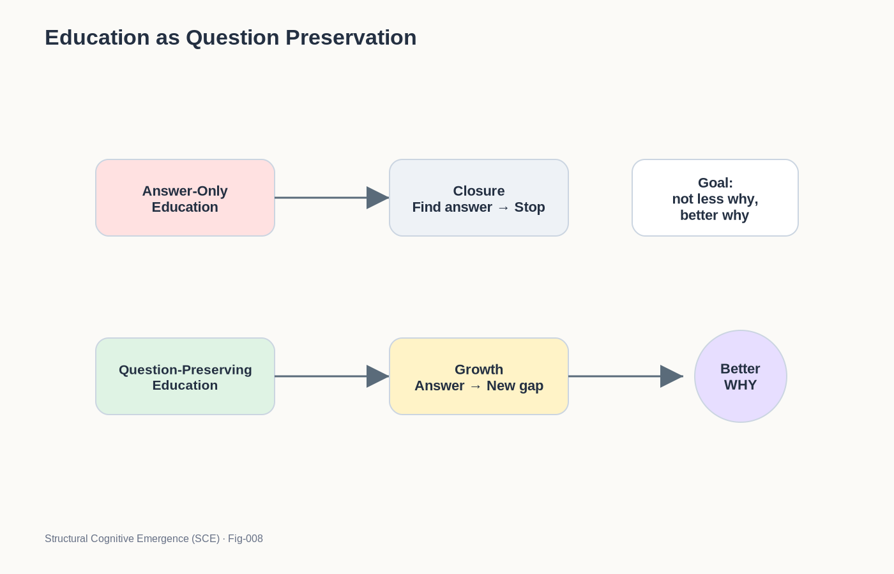

# SCE-008 — EDUCATION AS QUESTION PRESERVATION

## Why the Future of Education May Depend as Much on Preserving Questions as Delivering Answers

### Structural Cognitive Emergence (SCE)

---

# Introduction

Education is one of humanity's greatest achievements.

Through education, each generation inherits the knowledge accumulated by countless generations before it.

Science, mathematics, engineering, medicine, literature, and history all depend upon this process.

Without education, civilization could not exist.

Yet an important question remains:

> What is the true purpose of education?

A common answer is:

```text
Knowledge Transfer
```

Students learn what previous generations discovered.

This answer is correct.

But it may be incomplete.

Structural Cognitive Emergence proposes an additional perspective:

> Education is not only the transfer of knowledge.
>
> Education is also the preservation of question generation.

Knowledge provides structure.

Questions provide growth.

Both are necessary.

---
#### Fig-008-EDUCATION-AS-QUESTION-PRESERVATION.png



---

# The Child Before School

Before entering formal education, many children exhibit remarkable curiosity.

They ask:

```text
Why?

Why?

Why?
```

about almost everything.

Examples include:

```text
Why is the sky blue?

Why do cats meow?

Why do leaves fall?

Why do people sleep?
```

The child is not following a curriculum.

The child is following gaps.

As discussed in previous SCE documents:

```text
Structure Growth
↓
Gap Detection
↓
Question Emergence
```

naturally drives exploration.

Question generation is spontaneous.

---

# The Educational Shift

Formal education introduces a new objective.

The child begins encountering:

```text
Correct Answers
```

```text
Standard Methods
```

```text
Established Knowledge
```

These are essential.

However, the optimization target often changes.

The child originally operates as:

```text
Question
↓
Exploration
↓
Learning
```

The educational system frequently operates as:

```text
Question
↓
Answer
↓
Evaluation
```

The difference appears subtle.

Its long-term consequences may be profound.

---

# Knowledge Is Not the Problem

SCE does not argue against knowledge.

Knowledge is indispensable.

Without accumulated knowledge:

```text
Science
Engineering
Medicine
Civilization
```

would be impossible.

The issue is not knowledge itself.

The issue is whether knowledge supports further question generation.

A healthy cognitive structure should behave as:

```text
Knowledge
↓
New Questions
↓
New Exploration
```

rather than:

```text
Knowledge
↓
Closure
```

---

# The Closure Problem

One unintended consequence of some educational systems is premature closure.

Students may gradually learn:

```text
The answer already exists.
```

```text
The textbook knows.
```

```text
The teacher knows.
```

```text
The examination knows.
```

This can produce an unfortunate cognitive habit:

```text
Find Answer
↓
Stop
```

Instead of:

```text
Find Answer
↓
Discover New Gap
↓
Continue
```

The difference determines whether growth continues.

---

# Answers and Boundaries

Every answer creates a boundary.

For example:

```text
Why is the sky blue?
↓
Rayleigh Scattering
```

This answer resolves one gap.

But it also creates many new gaps:

```text
Why does scattering occur?

Why does wavelength matter?

Why does the atmosphere behave this way?
```

Good education should reveal these new boundaries.

Every answer should become the beginning of another exploration.

---

# Education as Graph Expansion

From the SCE perspective, learning is fundamentally:

```text
Calling Graph Growth
```

The role of education is therefore not merely to deliver isolated facts.

The role of education is to expand the learner's graph.

A concept such as:

```text
CAT
```

should not remain a label.

It should become:

```text
CAT
 ├── Animal
 ├── Tiger
 ├── Pet
 ├── Evolution
 ├── Ecology
 └── Behavior
```

The richer the graph becomes, the more opportunities exist for gap detection and question emergence.

---

# The Preservation of Why

Children naturally generate Why questions.

Education should not eliminate this tendency.

Instead, education should refine it.

The goal is not:

```text
Less Why
```

The goal is:

```text
Better Why
```

A young child asks:

```text
Why do cats meow?
```

A scientist asks:

```text
Why do mammals evolve vocal communication systems?
```

The sophistication changes.

The underlying mechanism remains.

Education succeeds when curiosity matures rather than disappears.

---

# Question Density Across Life

SCE introduces the concept of:

```text
Question Density
```

Question Density measures how frequently a cognitive system generates meaningful questions from its structures.

Children often exhibit:

```text
High Question Density
```

Many adults exhibit:

```text
Lower Question Density
```

The objective of education should not be to reduce question density.

Instead, education should help transform:

```text
Simple Questions
```

into:

```text
Powerful Questions
```

---

# The Best Teachers

From the SCE perspective, the best teachers may not simply be answer providers.

They may be:

```text
Gap Revealers
```

A great teacher often does three things:

1. Builds cognitive structures.

2. Reveals hidden gaps.

3. Encourages exploration.

The student leaves not merely with answers.

The student leaves with new questions.

---

# Scientific Education

Science itself provides an excellent model.

Scientific progress rarely proceeds as:

```text
Question
↓
Answer
↓
Finished
```

Instead:

```text
Question
↓
Answer
↓
Larger Question
```

Every major discovery opens new frontiers.

Therefore scientific education should communicate not only what is known.

It should also communicate:

```text
What remains unknown.
```

---

# Entrepreneurship and Education

Entrepreneurship provides another perspective.

Many successful entrepreneurs excel at noticing:

```text
Inefficiency
```

```text
Friction
```

```text
Missing Connections
```

In SCE language:

```text
Structural Gaps
```

Education that preserves gap sensitivity may therefore support not only science but also innovation and leadership.

---

# The Risk of Answer Optimization

A system optimized exclusively for answers may become extremely efficient.

However, it may also become less exploratory.

This principle applies to:

* students,
* institutions,
* organizations,
* and potentially AI systems.

Excessive answer optimization may reduce:

```text
Gap Detection
```

which reduces:

```text
Question Emergence
```

which ultimately reduces:

```text
Long-Term Growth
```

---

# Education and Future AI

The same challenge appears in artificial intelligence.

Current systems are increasingly powerful answer generators.

Future autonomous systems may require:

```text
Persistent Structures
```

```text
Gap Sensitivity
```

```text
Question Generation
```

```text
Exploration Loops
```

In this sense, the future of education and the future of AI may face remarkably similar questions.

Both must determine how to preserve curiosity while expanding knowledge.

---

# The Preservation Principle

SCE proposes a simple educational principle:

> Every answer should increase the capacity to generate future questions.

If an answer closes exploration permanently, growth may slow.

If an answer expands the learner's graph and reveals new boundaries, growth continues.

Education therefore becomes:

```text
Knowledge Growth
+
Question Preservation
```

rather than:

```text
Knowledge Growth
-
Question Generation
```

---

# The Central Hypothesis

The central hypothesis of this document is:

> The long-term success of education depends not only on transmitting answers but also on preserving the learner's capacity for question generation.

In SCE terms:

```text
Structure Growth
↓
Gap Detection
↓
Question Emergence
↓
Exploration
↓
Further Structure Growth
```

is one of the fundamental loops of cognitive development.

Education succeeds when this loop remains alive.

The purpose of education is not merely to fill minds.

The purpose of education is to help minds continue growing.

---

## Next

SCE-009

From Why to Autonomous AI

Why meaningful autonomous intelligence may require internal question emergence rather than answer generation alone.
