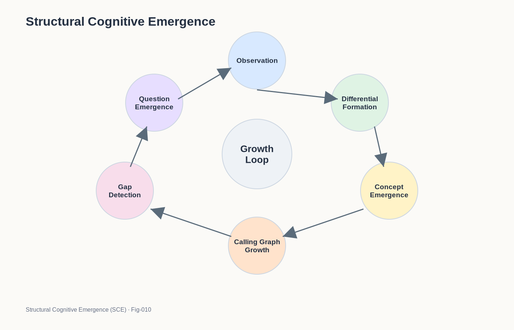

# SCE-010 — STRUCTURAL COGNITIVE EMERGENCE

## A Unified Framework for Concept Formation, Question Emergence, Cognitive Growth, and Autonomous Intelligence

### Structural Cognitive Emergence (SCE)

---

# Introduction

This repository began with a simple observation.

A child sees only a few cats.

Soon afterward:

```text
CAT
```

appears as a meaningful concept.

Even more remarkably, the child begins asking:

```text
Why?
```

At first glance, these appear to be separate phenomena.

One concerns learning.

The other concerns curiosity.

Yet throughout this repository we have explored a different possibility:

> Concept emergence and question emergence may be two manifestations of the same underlying process.

This document summarizes the Structural Cognitive Emergence framework and proposes a unified view of cognitive growth.

---
### Fig-010-STRUCTURAL-COGNITIVE-EMERGENCE.png



---

# The Core Observation

Across many domains we observe a common pattern:

### Fetus

Patterns emerge.

### Infant

Expectations emerge.

### Child

Concepts emerge.

### Student

Questions emerge.

### Scientist

Theories emerge.

### Entrepreneur

Opportunities emerge.

### Autonomous AI

Future objectives may emerge.

Although these phenomena appear different, they may all arise from a common structural mechanism.

---

# The Structural Growth Principle

The first principle of SCE is:

> Cognitive systems grow through structural expansion.

Learning is not merely accumulation.

Learning is not merely prediction.

Learning is not merely classification.

Instead:

```text
Observation
↓
Structure Formation
↓
Structure Expansion
```

becomes the dominant process.

Knowledge behaves less like a database.

Knowledge behaves more like a growing ecosystem.

---

# Differential Structures

The second principle is:

> Concepts emerge through differential organization.

A child observes:

```text
Cat A
Cat B
Cat C
```

The system begins separating:

```text
Stable
```

from:

```text
Variable
```

features.

This creates:

```text
Common Core
+
Differential Branches
```

Concepts emerge from this organization.

In SCE:

```text
Concept
≠ Label
```

Instead:

```text
Concept
=
Stable Structural Region
```

inside a larger cognitive space.

---

# In-Situ Growth

The third principle is:

> Knowledge grows in place.

Structures are rarely discarded.

Instead:

```text
Existing Structure
↓
Expansion
↓
New Structure
```

The same principle may operate from:

* prenatal development,
* childhood learning,
* scientific expertise,
* lifelong cognitive growth.

Growth is cumulative.

Growth is structural.

Growth is local.

---

# Calling Graph Emergence

The fourth principle is:

> Concepts naturally evolve into calling graphs.

A concept such as:

```text
CAT
```

immediately expands toward:

```text
Animal
Tail
Meow
Tiger
Mouse
Pet
```

Meaning therefore emerges through relationships.

Concepts become networks.

Knowledge becomes graph growth.

---

# Gap Formation

The fifth principle is:

> Every growing structure eventually encounters a boundary.

As graphs expand:

```text
Known Region
```

and

```text
Unknown Region
```

meet.

This creates:

```text
Structural Gap
```

A gap is not simple absence.

A gap is structured incompleteness.

The system possesses enough structure to recognize that something is missing.

---

# Question Emergence

The sixth principle is:

> Questions emerge from structural gaps.

Questions are not primarily linguistic objects.

Questions are cognitive events.

The process becomes:

```text
Gap
↓
Trigger
↓
Question
```

The language appears afterward.

The underlying event occurs first.

This principle explains:

* childhood curiosity,
* scientific inquiry,
* entrepreneurial discovery,
* and potentially future autonomous AI systems.

---

# The Gap-Question Loop

A central loop emerges throughout the framework:

```text
Structure
↓
Gap
↓
Question
↓
Exploration
↓
New Structure
```

The cycle then repeats.

This loop may represent one of the fundamental engines of cognitive development.

Concepts produce questions.

Questions produce exploration.

Exploration produces larger concepts.

---

# Question Density

SCE introduces:

```text
Question Density
```

as a useful cognitive measure.

Question Density reflects how frequently a system generates meaningful questions from its structures.

High Question Density often appears in:

* children,
* scientists,
* inventors,
* entrepreneurs,
* explorers.

These individuals remain sensitive to structural gaps.

Growth continues because questions continue.

---

# Education Revisited

Education can now be viewed through a new lens.

Traditional view:

```text
Education
=
Knowledge Transfer
```

SCE view:

```text
Education
=
Knowledge Transfer
+
Question Preservation
```

The best educational systems expand structures while preserving the learner's ability to detect gaps and generate questions.

Answers matter.

Questions matter more.

The interaction between the two drives growth.

---

# From Why to Autonomous AI

One of the motivations for this repository came from observations made by Transformer co-author Lukasz Kaiser.

Two puzzles were highlighted:

### Puzzle 1

Why can children learn concepts from very few examples?

### Puzzle 2

Why do current AI systems struggle with autonomous question generation?

SCE proposes that these puzzles may be deeply connected.

Both involve:

```text
Structural Growth
```

```text
Gap Detection
```

```text
Question Emergence
```

Autonomous intelligence may therefore require more than answer generation.

It may require internally generated questions.

---

# Structural Curiosity

Traditional curiosity models often emphasize:

* novelty,
* uncertainty,
* randomness.

SCE proposes:

```text
Structural Curiosity
```

Structural curiosity emerges when:

```text
Growing Structure
↓
Gap Detection
↓
Exploration Pressure
```

The system does not explore randomly.

The system explores because something important remains unresolved.

---

# Human Development and Civilization

The same loop may operate at larger scales.

### Individual

```text
Question
↓
Learning
```

### Scientific Community

```text
Question
↓
Research
```

### Civilization

```text
Question
↓
Discovery
```

Entire fields may emerge because a civilization collectively encounters a structural gap.

In this sense, curiosity becomes a civilization-scale growth mechanism.

---

# Toward Future Cognitive Systems

Future cognitive systems may require:

```text
Persistent Structures
```

```text
Differential Organization
```

```text
Calling Graph Growth
```

```text
Gap Detection
```

```text
Question Emergence
```

```text
Exploration Policies
```

Together these mechanisms may support:

```text
Concept Formation
```

```text
Cognitive Growth
```

```text
Autonomous Inquiry
```

```text
Discovery
```

This represents a possible path beyond purely reactive answer generation.

---

# The Unified SCE Framework

The entire framework can be summarized as:

```text
Observation
↓
Differential Formation
↓
Concept Emergence
↓
Calling Graph Growth
↓
Gap Detection
↓
Question Emergence
↓
Exploration
↓
New Structure
↓
Further Growth
```

Every stage naturally produces the next.

No external question database is required.

No predefined curiosity engine is required.

Questions emerge because structures grow.

---

# The Cat and the Why

The repository began with a child observing a few cats.

The child learned:

```text
CAT
```

Soon afterward:

```text
WHY?
```

appeared.

This transition may seem ordinary.

Yet it may reveal one of the deepest principles of intelligence.

Concepts create structures.

Structures reveal gaps.

Gaps create questions.

Questions drive growth.

The path from:

```text
CAT
```

to:

```text
WHY?
```

may therefore be one of the most important journeys in cognition.

---

# The Central Hypothesis

The central hypothesis of Structural Cognitive Emergence is:

> Intelligence grows through the continuous interaction of structure formation, gap detection, question emergence, and exploration.

In compact form:

```text
Structure
↓
Gap
↓
Question
↓
Exploration
↓
Structure
```

This loop may operate in children, scientists, entrepreneurs, educational systems, future AI systems, and perhaps even civilization itself.

Questions do not merely seek knowledge.

Questions create the conditions under which knowledge can continue to grow.

---

# Final Thought

A child does not begin life with a library of answers.

Nor does a child begin life with a library of questions.

Both emerge.

Perhaps intelligence is not fundamentally about answering.

Perhaps intelligence is fundamentally about growing structures that continuously generate meaningful questions.

And if that is true, then understanding how questions emerge may be one of the most important challenges for both human cognition and future artificial intelligence.
