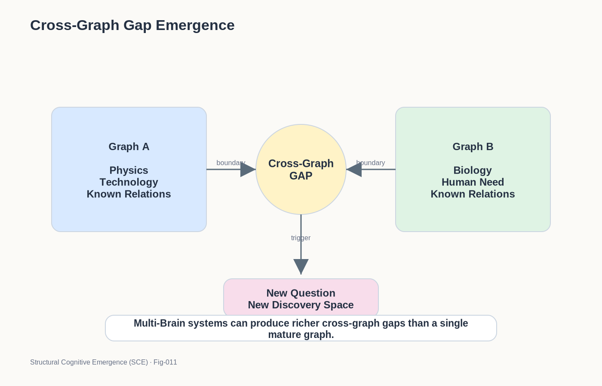

# SCE-011 — CROSS-GRAPH GAP EMERGENCE
## Why Many Important Questions Emerge Between Cognitive Structures Rather Than Within Them
### Structural Cognitive Emergence (SCE)

## Introduction

Throughout this repository, Structural Cognitive Emergence has focused on a central mechanism:

    Structure
    ↓
    Gap
    ↓
    Question
    ↓
    Exploration
    ↓
    New Structure

This framework explains:

- concept formation,
- curiosity,
- scientific inquiry,
- educational growth,
- and potentially future autonomous AI.

However, an important question remains:

> Where do the largest and most transformative questions come from?

Many questions emerge inside a cognitive structure.

But some of the most important questions may emerge between cognitive structures.

This document introduces:

    Cross-Graph Gap Emergence

as a possible extension of the SCE framework.

---
### Fig-011-CROSS-GRAPH-GAP-EMERGENCE.png

---

## The Limitation of Single-Graph Thinking

Consider a mature cognitive graph:

    Graph A

Over time:

    Observation
    ↓
    Expansion
    ↓
    Refinement

occurs repeatedly.

Eventually:

    Gap
    ↓
    Question

continues to appear.

However, a highly mature graph may gradually stabilize.

Many internal inconsistencies become resolved.

Many obvious questions disappear.

Growth continues.

But the rate of new gap formation may decrease.

This creates an important limitation.

## The Physics Example

Consider a physicist.

Inside the physics graph:

    Mechanics
    Thermodynamics
    Electromagnetism
    Quantum Theory

many questions emerge naturally.

However, some of the most important discoveries occur when:

    Physics

encounters:

    Biology

For example:

    Energy

meets:

    Life

or:

    Information

meets:

    Evolution

New questions suddenly appear.

The source of these questions is not internal inconsistency.

The source is graph interaction.

## Cross-Graph Gaps

SCE defines:

    Cross-Graph Gap

as:

> A structural inconsistency, missing relationship, unexplained overlap, or unresolved boundary between two or more cognitive graphs.

For example:

    Graph A

contains:

    Known Relation

while:

    Graph B

contains:

    Apparently Similar Relation

yet no connecting explanation exists.

A gap appears.

A question emerges.

## The Tiger Example

Suppose a child possesses:

    CAT GRAPH

and later develops:

    TIGER GRAPH

Initially the two graphs may remain separate.

Eventually the child notices:

    Tiger
    looks like
    Cat

A new gap appears:

    Why?

The question does not originate inside either graph alone.

The question originates between them.

## Scientific Revolutions

Many scientific revolutions appear to follow this pattern.

Examples include:

### Physics ↔ Astronomy
    Apple Falls
    Moon Moves
    
    ↓
    
    Why are these related?

### Biology ↔ Geology
    Species Variation
    Island Isolation
    
    ↓
    
    Why do species change?

### Mathematics ↔ Physics
    Equations
    Natural Laws
    
    ↓
    
    Why does mathematics describe reality?

In each case:

    Graph A
    ↔
    Graph B

creates a new question space.

## Entrepreneurship as Cross-Graph Gap Detection

Entrepreneurship provides another example.

Many innovations emerge because someone simultaneously sees:

    Technology Graph

and:

    Human Need Graph

Most people operate inside one graph.

Entrepreneurs often operate between them.

For example:

    Internet Technology

meets:

    Retail Commerce
    
    ↓
    
New Opportunity

    Mobile Devices

meets:

    Transportation
    
    ↓

New Opportunity

The innovation emerges from the gap between structures.

## Human Civilization as a Multi-Graph System

Human civilization is not a single cognitive graph.

It is a vast collection of specialized graphs.

Examples include:

    Physics
    Chemistry
    Biology
    Medicine
    Economics
    Engineering
    Law
    Education

Each graph evolves independently.

The greatest discoveries often occur at the boundaries.

Civilizational progress may therefore depend heavily on:

    Cross-Graph Gap Production

rather than solely on internal graph refinement.

## Why Multiple Brain Units Matter

This observation has important implications for future AI.

Suppose we build:

    One Giant Model

Its internal graph may become extremely large.

However, it remains:

    One Cognitive Organism

Now consider:

    Many Specialized Brain Units

Each unit develops distinct structures.

Examples:

    Physics AI
    
    Biology AI
    
    Economics AI
    
    Education AI

Interactions between these units continuously generate:

    Cross-Graph Gaps

The result may be a much richer source of question generation.

## Autonomous AI Revisited

Previous SCE documents proposed:

    Structure
    ↓
    Gap
    ↓
    Question

as a foundation for autonomy.

Cross-Graph Gap Emergence extends this idea:

    Graph A
    ↔
    Graph B
    ↓
    Gap
    ↓
    Question

This mechanism may be especially important once individual graphs become mature.

Cross-graph interaction provides a continuous source of novelty and exploration pressure.

## From Single-Brain Curiosity to Civilizational Curiosity

Childhood curiosity often operates inside one growing graph.

Civilizational curiosity may operate across many graphs.

The progression may be:

    Concept Gap
    
    ↓
    
    Graph Gap
    
    ↓
    
    Cross-Graph Gap
    
    ↓
    
    Civilizational Discovery

The scale changes.

The mechanism remains surprisingly similar.

## Human-AI Hybrid Discovery

An especially interesting possibility emerges when human and AI cognitive systems coexist.

Humans possess:

    Human Graphs

AI systems possess:

    AI Graphs

The interaction creates:

    Human ↔ AI Gaps

Questions may emerge that neither system would discover independently.

The result becomes:

    Human
    +
    AI
    =
    Expanded Gap Space

This may become one of the most important engines of future discovery.

## The Cross-Graph Discovery Loop

SCE proposes the following extension:

    Graph A
    ↔
    Graph B
    ↓
    Cross-Graph Gap
    ↓
    Question
    ↓
    Exploration
    ↓
    New Structures
    ↓
    New Cross-Graph Gaps

The loop continuously expands.

New structures create new boundaries.

New boundaries create new questions.

## The Central Hypothesis

The central hypothesis of this document is:

> Many of the most important questions do not emerge from individual cognitive structures.

> They emerge from the interaction between cognitive structures.

In compact form:

    Graph A
    ↔
    Graph B
    ↓
    Gap
    ↓
    Question
    ↓
    Discovery

Cross-Graph Gap Emergence may therefore represent a fundamental mechanism behind scientific revolutions, entrepreneurship, civilizational progress, and future multi-brain autonomous intelligence.

## Final Thought

A child learns by discovering gaps inside a growing concept.

A scientist learns by discovering gaps inside a growing theory.

A civilization advances by discovering gaps between growing theories.

Perhaps the future of intelligence is not merely building larger graphs.

Perhaps it is creating richer interactions between graphs.

Because the most important question may not be hidden inside a structure.

It may be hidden between structures.

## Outlook

Potential future directions include:

- Cross-Graph Gap Metrics (CGGM)
- Cross-Graph Question Density (CGQD)
- Multi-Brain Question Generation (MBQG)
- Human-AI Cross-Graph Discovery Systems
- Function Tunnel Networks as Gap Generators
- Civilizational Curiosity Engines

These directions may extend Structural Cognitive Emergence from individual cognition to collective and civilizational intelligence.